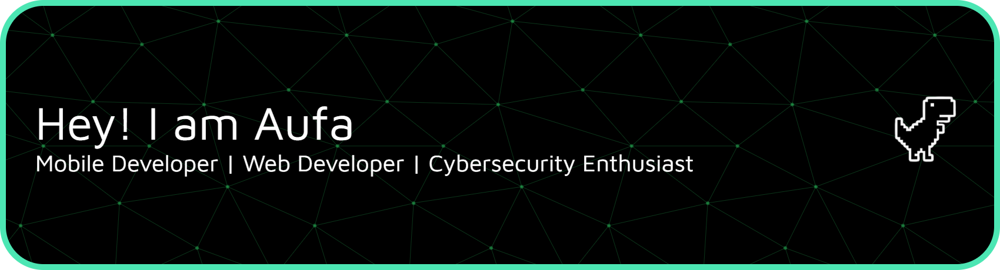

  
  

---

## 👤 Tentang Saya
Saya adalah seorang mahasiswa **Teknologi Informasi** di **Universitas Lambung Mangkurat**. Fokus saya mencakup pengembangan aplikasi mobile multi-platform, pembuatan aplikasi web interaktif, eksplorasi dunia *Cybersecurity*, serta riset kecerdasan buatan untuk keamanan siber.

<table>
  <tr>
    <!-- Kolom Kiri: Fokus Proyek dengan Mini-Badges -->
    <td width="50%" valign="top">
      <h3>🚀 Fokus & Proyek</h3>
      

         
        Mengembangkan aplikasi berbasis data (seperti Room DB) menggunakan Kotlin/Jetpack Compose & Flutter.
      

      

         
        Membangun platform web interaktif dan integrasi sistem, salah satunya adalah <b>Projek Integrasi Sistem Jersey</b>.
      

      

         
        Memecahkan tantangan CTF dan eksplorasi matematika kriptografi seperti Linear Congruential Generator (LCG).
      

      

         
        Meneliti penerapan <i>AI Neurosimbolik</i> untuk deteksi pola phishing secara logis.
      

    </td>
    <!-- Kolom Kanan: Tech Stack -->
    <td width="50%" valign="top">
      <h3>🛠️ Tech Stack & Tools</h3>
      <b>Web Development Stack:</b> 
      
      
      
        
      <b>Mobile Development:</b> 
      
      
      
      
        
      <b>Databases & Security:</b> 
      
      
      
        
      <b>Tools & IDEs:</b> 
      
      
      
    </td>
  </tr>
</table>

---

## 🎮 Di Luar Waktu Koding
Ketika sedang beristirahat dari layar IDE atau terminal, saya biasanya menghabiskan waktu untuk:
* ⚔️ Menguji ketangkasan dan menyusun strategi berburu di **Monster Hunter**.
* 🚜 Menikmati waktu santai mengelola peternakan virtual di **Hay Day**.
* 👥 Berkumpul dan berkolaborasi dalam kepanitiaan atau proyek kelompok mahasiswa.

---

## 📊 Aktivitas GitHub
<table align="center" border="0" cellpadding="0" cellspacing="0">
  <tr>
    <td>
      
    </td>
    <td>
      
    </td>
  </tr>
</table>

<picture data-importer="pacman">
  <source media="(prefers-color-scheme: dark)" srcset="https://raw.githubusercontent.com/AuFaMiReDo/AuFaMiReDo/pacman-output/pacman-contribution-graph-dark.svg?game=pacman">
  <source media="(prefers-color-scheme: light)" srcset="https://raw.githubusercontent.com/AuFaMiReDo/AuFaMiReDo/pacman-output/pacman-contribution-graph.svg?game=pacman">
  
</picture>

<!-- ###

 -->
